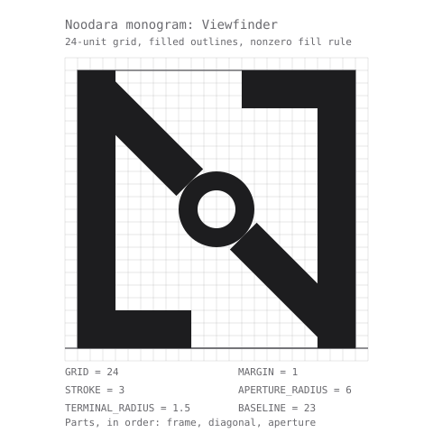

# Noodara brand kit

Everything needed to draw, place and export the Noodara mark. The drawing itself lives in
`packages/ui/src/brand/geometry.ts`; this page explains it, and every number below is the one that
module exports. If the two ever disagree, the module is right and
`tests/unit/docs/brand-kit-structure.test.ts` fails.

## Meaning

Noodara is an invented name, chosen for how it sounds. It has no etymology and no story to
illustrate, so the mark does not try to depict the word. It depicts what the product does.

The product's promise is "Your infrastructure, understood." Other tools administer servers;
Noodara is built to let a person understand them. So the mark encodes seeing clearly: a lens, an
aperture, a signal that resolves into something sharp. It is a capital N, because the mark has to
read as the company at 16 px, not as an abstract symbol that needs a caption.

The approved construction is Viewfinder, described in its own words:

> The letter becomes a viewfinder -- brackets frame the subject and the centre ring is where it sharpens.

The N's two stems close with a short inward return at the corners the diagonal does not touch, so
the skeleton reads as the two corner brackets of a viewfinder. The diagonal runs between them and
breaks open at the centre, where a small ring marks the point of focus.

## Construction

The mark is built on a 24-unit grid from named constants, using straight lines and circular arcs
only. There is no cubic curve anywhere in it, so it can be reproduced with a ruler and a compass.



| Constant | What it fixes |
| --- | --- |
| `GRID = 24` | The design grid. Every coordinate in the mark is expressed in these units. |
| `MARGIN = 1` | Breathing room inside the box: no ink touches the edge of the viewBox. |
| `STROKE = 3` | Stem, diagonal and wordmark weight. The wordmark carries the monogram's weight, not a weight picked for text. |
| `APERTURE_RADIUS = 6` | The aperture's outer radius, and the radius of the wordmark's round letters. |
| `TERMINAL_RADIUS = 1.5` | Half a stroke, so a capped stem ends flush with its own width. |
| `X_HEIGHT = 12` | The wordmark's x-height. It is the aperture's diameter. |
| `ASCENDER = 18` | The height of the wordmark's "d". |
| `LETTER_GAP = 2` | Side bearing between two letters: tight tracking. |
| `LOCKUP_GAP = 6` | The gap between the monogram and the wordmark in the horizontal lockup. |
| `BASELINE = 23` | The wordmark's baseline, which is also the monogram's bottom edge. |

The monogram has three parts, drawn in this order:

- **frame** — two full-height bars `STROKE` wide standing on the margin box, plus two returns, each
  `STROKE + APERTURE_RADIUS` long and `STROKE` thick, at the top-right and bottom-left corners. Those
  are the two corners the diagonal does not reach, so the returns read as framing marks instead of
  turning the diagonal into a double-headed arrow.
- **diagonal** — two bars at 45 degrees between the stems, stopping short of the centre to leave a
  gap of `APERTURE_RADIUS`.
- **aperture** — a ring centred on the grid, outer radius `APERTURE_RADIUS / 2` so it exactly fills
  that gap, with its counter half a stroke inside.

Every shape is a closed filled outline with the stroke weight baked into its own geometry. The mark
is never drawn with a live `stroke` attribute: a stroke width scales inconsistently between a 16 px
favicon raster and a 256 px presentation render, and the filled outline is what keeps the mark crisp
at 16 px. For the same reason the fill rule is the SVG default, nonzero, and never `evenodd`. Parts
overlap on purpose — the diagonal runs into the frame — and under `evenodd` every overlap would
punch a hole. The holes that are meant to be holes, such as the aperture's counter, are cut by
winding the inner circle against the outer one, which is exactly what the nonzero rule reads.

The wordmark is drawn from the same constants. It sits on `BASELINE`, its round letters are the
monogram's aperture at the same radius and the same counter, its x-height is that aperture's
diameter, and its one ascender is the "d". Letters advance by their own ink plus one `LETTER_GAP`.
The "r" is the exception: it is the only letter whose ink reaches its full width at a single height,
so spacing it by its bounding box opened a wedge of white and the word read as two words. Its advance
is instead the aperture circle's own half-chord at the height where the counter ends (5.196 units
against the box's 7.5) — a real optical kern that tucks the final "a" under the shoulder, which is
where that pair is set in geometric sans faces.

## Lockups

There are three, and each one belongs to specific surfaces.

| Lockup | Where it goes |
| --- | --- |
| Monogram | The 64 px collapsed sidebar rail, the favicon, the apple-touch-icon and the PWA icons. |
| Horizontal lockup | The expanded sidebar from 1280 px up, the `/login` and `/setup` card, the README and the public site. |
| Wordmark | Running text, and the site title where the symbol would be redundant. |

The N in the horizontal lockup is the monogram: it is the same drawing at the same size, never a
second one. The gap between them is `LOCKUP_GAP`, and both sit on the same baseline. The lockup
measures 119.196 by 24 units; the wordmark alone measures 89.196 by 24.

Below 900 px the app carries no mark at all. The navigation there is a temporary overlay rather than
the product's chrome, and the space is better spent on the navigation itself.

## Clear space and minimum size

Clear space is `STROKE` grid units on every side of the mark — one eighth of its height, at any
size. So a 24 px monogram keeps 3 px clear, and the 64 px rail keeps 8 px. Nothing enters that band:
no text, no rule, no icon, no edge of a container. For the horizontal lockup the band is measured
from the ink, which means from the left edge of the monogram and the right edge of the final "a".

Minimum sizes:

| Lockup | Minimum |
| --- | --- |
| Monogram | 16 px, and 24 px inside the product. |
| Horizontal lockup | 100 px wide, which is 20 px tall. |
| Wordmark | 60 px wide, which is 16 px tall. |

16 px is the browser tab, and the mark was reviewed at that size on both a light and a dark tab
strip before it was approved. It is the floor: below it the aperture's counter closes and the ring
reads as a filled dot. Inside the product the monogram stays at 24 px or more, because it sits next
to a 20 px icon set and has to read as the identity rather than as one more icon.

## Color

Inside the app and in the README the mark is monochrome ink. It is painted with `currentColor` and
inherits `--ink` through the cascade, so one asset serves both themes: there is no light copy and
dark copy in the product, and no theme branch at any mount point.

The action blue is reserved for actions and states. The mark is never painted in the accent inside
the UI, and never competes with the one colour a person is meant to read as "this is clickable".

The one exception is the icon tile. The favicon, the apple-touch-icon and the PWA icons are a
rounded tile filled with `--accent-fill`, carrying the monogram in `--on-accent`. That tile is the
only surface in the entire system where the brand is blue, and it exists because a tab strip gives
the mark no context of its own.

The social image is light ink on the dark `--canvas`, in both themes, because a link preview has no
theme to follow.

Contexts with no theme CSS — the README, the public site, a slide — use the exported light and dark
SVGs instead of `currentColor`. Those files carry the same token values, written in at export time.

## Typography

The wordmark is drawn, not set. It is built from the monogram's own constants, so there is
no font file to license, nothing to subset, and no hinting to lose at 14 px. "noodara" is
lowercase, which is the register this category of developer tool is written in, and the two round
letters give it its optical balance.

The product's interface keeps the system font stack: San Francisco on Apple platforms, Inter as the
fallback. The wordmark never substitutes for that stack in running text, and the stack never
substitutes for the wordmark.

The tagline, "Your infrastructure, understood.", is set in the system stack in the display role,
with the same slightly negative tracking that role uses everywhere else.

## Misuse

- Do not add a second colour. The mark is one ink, and the tile is the only blue surface.
- Do not paint the mark in the accent colour inside the product interface.
- Do not apply a gradient to the mark, the wordmark or the tile.
- Do not add a glow, a halo or a blur behind the mark.
- Do not put a shadow on the mark or on the tile.
- Do not substitute an emoji or any other glyph for the mark.
- Do not stretch, squash or otherwise change the mark's proportions. Scale both axes together.
- Do not rotate the mark, or set it on an angle.
- Do not outline the mark, and do not redraw it with a live stroke. It is a filled shape.
- Do not place the mark on a photograph or a busy background without the tile.
- Do not redraw, trace or re-space the wordmark. Export it from the geometry.
- Do not crop the mark, or use one part of it — the aperture alone is not a logo.

## Assets and exports

Thirteen files are generated into `packages/ui/brand/`. They are written by a script and verified
byte for byte by a test; editing one by hand is always the wrong move.

| File | What it is |
| --- | --- |
| [monogram-light.svg](../../packages/ui/brand/monogram-light.svg) | The monogram, light-theme ink. |
| [monogram-dark.svg](../../packages/ui/brand/monogram-dark.svg) | The monogram, dark-theme ink. |
| [wordmark-light.svg](../../packages/ui/brand/wordmark-light.svg) | The wordmark, light-theme ink. |
| [wordmark-dark.svg](../../packages/ui/brand/wordmark-dark.svg) | The wordmark, dark-theme ink. |
| [lockup-light.svg](../../packages/ui/brand/lockup-light.svg) | The horizontal lockup, light-theme ink. |
| [lockup-dark.svg](../../packages/ui/brand/lockup-dark.svg) | The horizontal lockup, dark-theme ink. |
| [favicon.svg](../../packages/ui/brand/favicon.svg) | The tile at 512, the vector favicon. |
| [favicon.ico](../../packages/ui/brand/favicon.ico) | The tile at 16, 32 and 48, packed. |
| [apple-touch-icon.png](../../packages/ui/brand/apple-touch-icon.png) | The tile at 180, opaque. |
| [icon-192.png](../../packages/ui/brand/icon-192.png) | The tile at 192, for the web manifest. |
| [icon-512.png](../../packages/ui/brand/icon-512.png) | The tile at 512, for the web manifest. |
| [og-image.png](../../packages/ui/brand/og-image.png) | The social image, 1200 by 630, lockup and tagline on the dark canvas. |
| [brand-colors.json](../../packages/ui/brand/brand-colors.json) | The theme and background colours a web manifest needs, taken from the tokens. |

Anything inside the workspace reads them through the package: `@noodara/ui/brand/lockup-dark.svg`
resolves from any app or package without a copy step. For the live, theme-following mark in a React
surface, import the `Logo`, `Wordmark` and `Lockup` components from `@noodara/ui` instead — those
are the same drawing, painted with `currentColor`.

The web app is the one place that needs real copies, because Next.js discovers icons by filename.
`apps/web/scripts/sync-brand-assets.mjs` copies them out of this folder before every dev run and
every build, so the app never owns a second drawing and can never carry a stale mark.

For the README, where there is no theme CSS, use both exports:

```html
<picture>
  <source media="(prefers-color-scheme: dark)" srcset="packages/ui/brand/lockup-dark.svg">
  
</picture>
```

Regenerating, in the order you would need it:

- `pnpm brand:generate` — rewrite the thirteen exports from the geometry and the tokens.
- `pnpm brand:check` — read-only: fail if any committed export has drifted. This is the CI gate.
- `pnpm brand:construction` — rewrite the construction sheet on this page.
- `pnpm brand:boards` — render a full brand board per concept and theme, for review.
- `pnpm brand:review` — capture the mark on the real app surfaces, in both themes.

All five are idempotent: a second run with nothing to change reports that it changed nothing.

## Approval

The mark was approved on 2026-09-23, after one adjustment round of the two available. The record —
date, concept, rounds used, approver and the captures the approval was given against — is
[APPROVAL.md](APPROVAL.md), which lives beside this page at `docs/brand/APPROVAL.md`. The evidence
itself is in [approved/](approved/): the brand board plus the four in-app surfaces, each in the
light and the dark theme.

A test holds that record and the code to each other, so the approved concept and the one the app
renders cannot drift apart.
